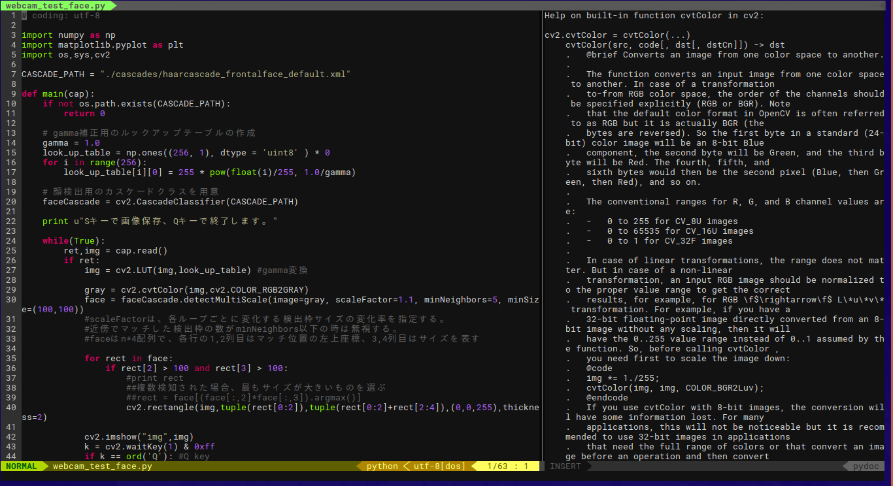

# pydoc_view.vim

pydoc integration plugin for vim.

:exclamation: This plugin is currently in an early stage of development. You may use this plugin, but there some bugs remain. If you find a problem, please report it to me.

## Feature

This plugin currently supports following features.

- run pydoc for the word under cursor and show results in another window.
- run pydoc for specified word.
- conpatible for multiple versions of python (python2 and python3)

## Install

Copy plugin/ directory to your vim runtimepath (for example: ~/.vim/).
You can also use any plugin management tool such as dein.vim:

```toml
[[plugin]]
repo = 'Kogia-sima/pydoc_view.vim'
```

## Usage

Use command `PydocView` to run pydoc for the word under cursor.
Use command `Pydoc <word>` to run pydoc for the specified word.

`Pydoc2` and `Pydoc3` command are also defined for Python2 and Python3 respectively.
`PydocView2` and `PydocView3` command are also defined.

You can toggle the pydoc window, which shows pydoc results, by:

```vim
call g:pydoc_view#toggle()
```

Some global variable can be defined for configuration.

#### g:pydoc_view_pydoc_cmd
Pydoc system command path (default is 'pydoc')

#### g:pydoc_view_pydoc2_cmd
Pydoc system command for Python2 (default is 'pydoc')

#### g:pydoc_view_pydoc3_cmd
Pydoc system command for Python3 (default is 'pydoc3')

#### g:pydoc_view_try_vertical
When set to 1, pydoc_view.vim tries to open pydoc window with vertical split (default is 1)

#### g:pydoc_view_width
Width of pydoc window (default is 65)

## Screenshot

